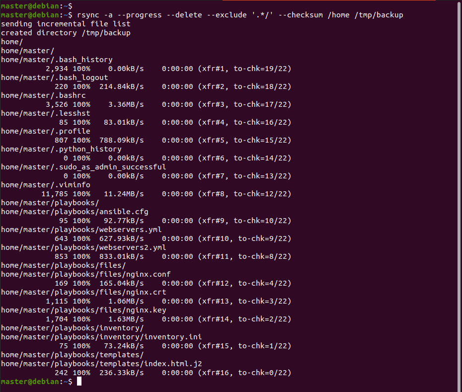
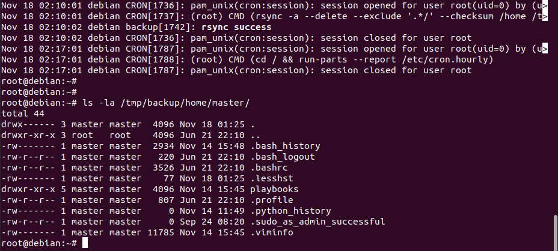

# Домашнее задание к занятию "`Резервное копирование`" - `Аблогин Павел`

---

### Задание 1

1. `Составил команду rsync, которая создает зеркальную копию домашней директории в директорию /tmp/backup`
2. `исключил из синхронизации все директории, начинающиеся с точки (скрытые)`
3. `rsync подсчитывал хэш-суммы для всех файлов`

`Скриншоты выполнения задания 1`

---

### Задание 2

1. `В cron запланирована команда на ежедневное однакратное выполнение зеркального бекапа домашнего каталога в каталог /tmp/backup`
2. `Результат выполнения логируется в системный журнал`

[Файл crontab](crontab.txt)

`Скриншоты выполнения задания 2`
`

---
